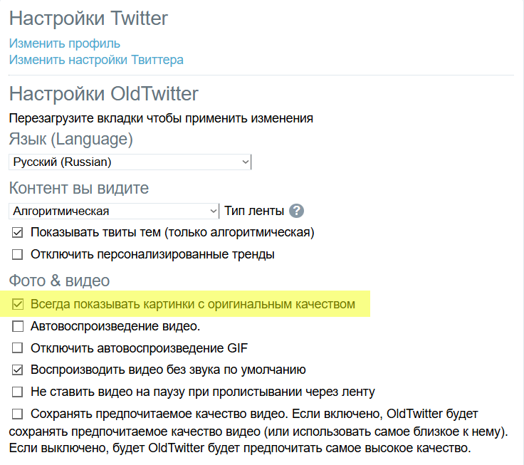
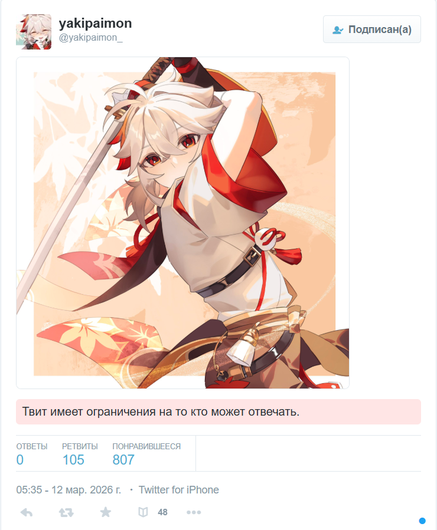
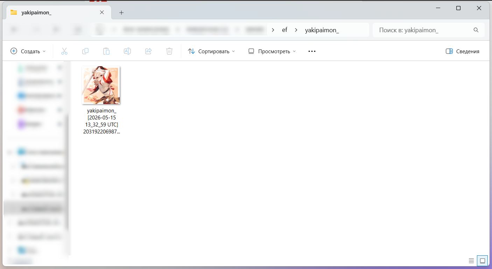

A script for extracting images from an MHT file containing a Twitter bookmarks/likes page.

You need to use the OldTwitterLayout extension with the display of original (uncompressed) images enabled.
 

Then open x.com/i/bookmarks or x.com/[@username]/likes and scroll to the bottom of the page, then save it in MHT (Opera's built-in saving function was tested).

For the resulting MHTML, run: ExtractTweetImages.exe -f bookmarks.mhtml -o extracted_folder

The filename format used by WFDownloader is preserved.

 

 
